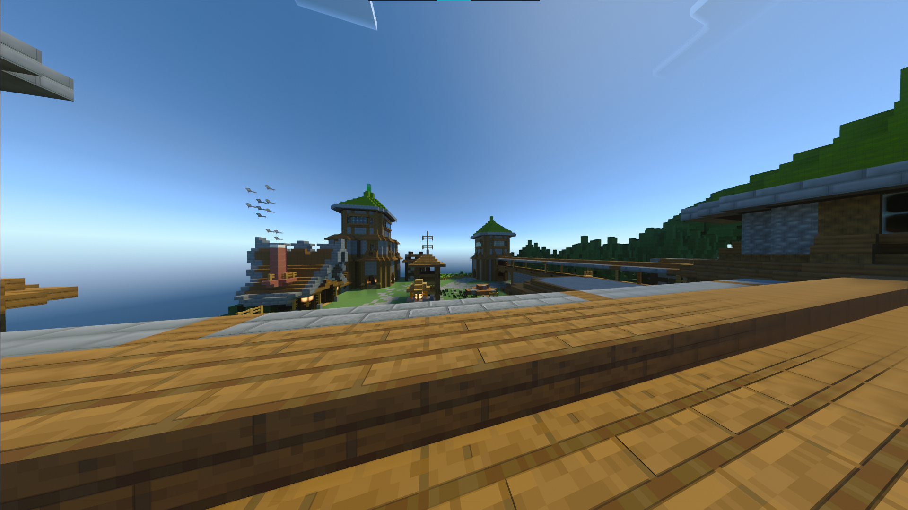

# Annihilation

## Game information

Annihilation is a team oriented mini-game. It is widely known for being run on The Shotbow Network (Minecraft: Java edition).

Annihilation is a team-based PvP game mode with 4 teams, Blue, Red, Yellow and Green. Your team's objective is to destroy the other 3 team's nexuses, while protecting your own. Each team has their own quarter of the map where they can gather resources, build defenses, etc. Your team wins if it is the last one with a nexus.

The game is split into 5 phases. Each phase lasts 10 minutes.
- Phase I: Nexus blocks are invincible
- Phase II: Nexus blocks lose their invincibility, Iron Golem boss mobs spawn
- Phase III: Diamond ores spawn in the middle
- Phase IV: It is possible to brew potions
- Phase V: Nexus damage is doubled

Once a team's nexus is destroyed, the team will no longer re-spawn. The remaining members of the team will remain in the game until they die, meaning they can still attack and destroy your nexus.

In order to win, your team must be the last one with a nexus.

In addition to the above, there are several kinds of shops in which players could buy items with gold ingots. Currently, there are 2 kinds of the shops, Brewing and Weapon.

## Waiting lobby

## Maps

### Amazon

### Andorra

### Canyon

### Cliffs

### Coastal

### Hamlet

### Kingdoms

### Planities

### Solumque

### Stoneheaven
