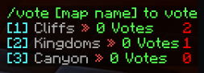

# Annihilation

Annihilation is a team oriented mini-game. It is widely known for being run on The Shotbow Network (Minecraft: Java edition).

## Before the game starts

### Voting

Before the game starts, there is possibility to vote for the map. You can select one of the three random maps, whose names are in the scoreboard.

Scoreboard:

To vote for a map, use command `/vote <map>`. You can either specify the number (1-3), or map name (for example Kingdoms).

### Team selection

You can choose to join one of the four teams using the nether star in your inventory or command `/<teamName>`

Team selection form:

### Class selection

You can also choose your class (kit), using the book item in your inventory. All the classes are for free. This may change in the future.

## How to play?

Annihilation is a team-based PvP game mode with 4 teams, Blue, Red, Yellow and Green. Your team's objective is to destroy the other 3 team's nexuses, while protecting your own. Each team has their own quarter of the map where they can gather resources, build defenses, etc. Your team wins if it is the last one with a nexus.

The game is split into 5 phases. Each phase lasts 10 minutes.
- Phase I: Nexus blocks are invincible
- Phase II: Nexus blocks lose their invincibility, Iron Golem boss mobs spawn
- Phase III: Diamond ores spawn in the middle
- Phase IV: It is possible to brew potions
- Phase V: Nexus damage is doubled

Once a team's nexus is destroyed, the team will no longer re-spawn. The remaining members of the team will remain in the game until they die, meaning they can still attack and destroy your nexus.

In order to win, your team must be the last one with a nexus.

In addition to the above, there are several kinds of shops in which players could buy items with gold ingots. Currently, there are 2 kinds of the shops, Brewing and Weapon.

## Phases

### Phase I
In Phase I it is recommended to gather resources from mines and smelt them in Ender Furnace. You can also try going in the middle of the map to get some iron blocks, whose are located under the middle beacon. You should prepare to fight the first boss and to face players rushing your team's nexus.

### Phase II
In Phase II nexus blocks lose their invincibility, which means your team might be rushed by the others. You should also try to kill boss to get OP items.

### Phase III
Diamond ores spawn in the middle. You should try to get diamond armour. Also you should get yourself bunch of golds for next phase to buy items for brewing.

### Phase IV
Brewing shop is now open, so you can buy items to brew potions to rush other teams. Mostly players brew strength, regeneration and fire resistance potions. Others try to rush with invisibility with no items in the inventory.

### Phase V
The game ends in Phase V. Finish other teams nexuses with double nexus damage!

# Maps

## Waiting lobby

## Maps

### Amazon

### Andorra

### Canyon

### Cliffs

### Coastal

### Hamlet

### Kingdoms

### Planities

### Solumque

### Stoneheaven
